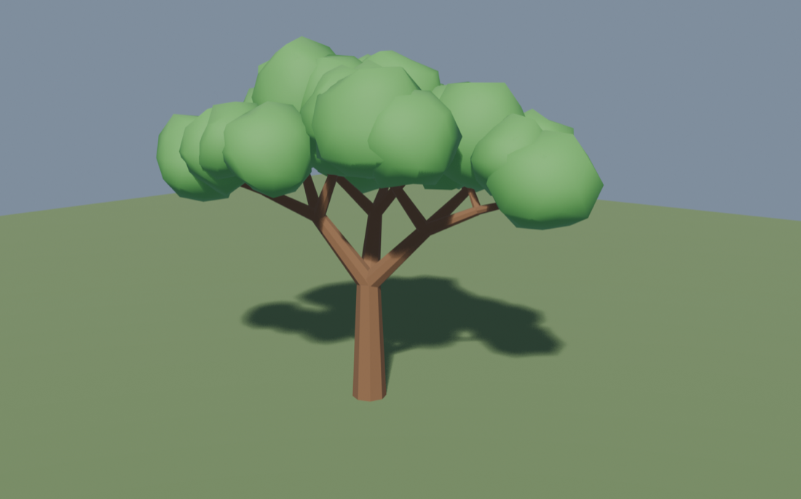

# blender-mcp-local

Drive [blender-mcp](https://github.com/ahujasid/blender-mcp) from a **local**
Gemma model in the terminal. No API keys, no cloud calls — Ollama serves the
model, [mcphost](https://github.com/mark3labs/mcphost) bridges it to the MCP
server, and Blender does the modeling.

```
you → mcphost → Ollama (gemma4-blender) → MCP tools → blender-mcp → Blender addon :9876
```

Ask for a tree in plain language and Blender builds one:

```
$ mcphost
> build a low-poly tree with a spreading canopy

[blender__get_scene_info]        → 3 objects (Cube, Light, Camera)
[blender__execute_blender_code]  → Built Tree_Trunk + Tree_Leaves_Canopy, 36 clusters
[blender__get_viewport_screenshot]
```



<sub>Rendered straight out of Blender. The generator is kept in
[`scripts/procedural_tree.py`](scripts/procedural_tree.py) — recursive tapered
branches, one roughened ico-sphere per branch tip.</sub>

---

## Requirements

| Component | Why | Install |
|---|---|---|
| [Ollama](https://ollama.com) | serves the local model | `brew install ollama` |
| [mcphost](https://github.com/mark3labs/mcphost) | MCP client that speaks to Ollama | `brew install mcphost` |
| [uv](https://docs.astral.sh/uv/) | runs `blender-mcp` via `uvx` | `brew install uv` |
| Blender 3.0+ | the thing being driven | [blender.org](https://www.blender.org/download/) |
| BlenderMCP addon | exposes Blender on port 9876 | [ahujasid/blender-mcp](https://github.com/ahujasid/blender-mcp) |

Built and tested on macOS (Apple Silicon) with **Blender 4.x**, **mcphost 0.34.0**,
and **gemma4:e4b** (8B, Q4_K_M).

---

## Install

```bash
git clone https://github.com/<you>/blender-mcp-local.git
cd blender-mcp-local
./install.sh
```

`install.sh` builds the Ollama model variant and writes the configs into `$HOME`.
It prints every path it touches and refuses to clobber an existing
`~/.mcphost.yml` without asking.

<details>
<summary>Manual install</summary>

```bash
# 1. Build the model variant (see "The context window trap" below)
ollama create gemma4-blender -f ollama/Modelfile.blender

# 2. Install the configs
cp config/mcphost.yml               ~/.mcphost.yml
cp config/blender-system-prompt.md  ~/.mcphost-blender-system.md

# 3. Point the system-prompt key at the absolute path
#    (mcphost does not expand ~ in this field)
sed -i '' "s|/Users/[^/]*/.mcphost-blender-system.md|$HOME/.mcphost-blender-system.md|" ~/.mcphost.yml
```
</details>

---

## Run

Start Blender, open the sidebar in the 3D viewport (press <kbd>N</kbd>), go to the
**BlenderMCP** tab and click **Connect**. Verify it's listening:

```bash
lsof -iTCP:9876 -sTCP:LISTEN
```

Then:

```bash
mcphost
```

`~/.mcphost.yml` is picked up automatically. One-shot mode works too:

```bash
mcphost -p "add a red cube at (3, 3, 0)" --compact
```

Useful flags:

```bash
mcphost --approve-tool-run     # confirm before each tool call — good for the first runs
mcphost -m ollama:gemma4:12b   # bigger model when e4b struggles on a complex build
mcphost --debug                # full protocol logging
```

---

## What's in here

```
config/mcphost.yml               mcphost config → ~/.mcphost.yml
config/blender-system-prompt.md  system prompt → ~/.mcphost-blender-system.md
ollama/Modelfile.blender         gemma4:e4b + 32k context, temp 0.4
scripts/procedural_tree.py       reference output: the tree generator
docs/tree.png                    the render above
examples/claude_desktop_config.example.json   same server, for Claude Desktop
install.sh                       does all of the above
LICENSE                          MIT
```

---

## Technical Problems

### 1. The context window trap

`gemma4:e4b` advertises **131072** tokens, but Ollama loads it at **4096** by
default. The 22 Blender tool schemas overflow that on their own — before any
scene JSON or generated Python. For example: the model ignores tools, loops, or
truncates code mid-function.

`ollama/Modelfile.blender` fixes it:

```
PARAMETER num_ctx 32768
```

Confirm the loaded context with `ollama ps` while a session is live — the
`CONTEXT` column must read 32768, not 4096.

### 2. `--quiet` prints nothing when tools are called

In mcphost 0.34.0, `--quiet` returns an **empty stdout and exit 0** on any run
involving tool calls. Plain Q&A prints fine, which makes it look like Blender
is the problem.

Use `--compact` for scripting instead.

### 3. Only one client at a time on port 9876

The Blender addon accepts a single connection. If Claude Desktop already has
`blender-mcp` running, mcphost will contend with it for the socket. Quit one
before using the other.

---

## Tuning the model

Everything is in `ollama/Modelfile.blender`. After editing, rebuild:

```bash
ollama create gemma4-blender -f ollama/Modelfile.blender
```

- **`num_ctx`** — drop to `16384` on 8GB machines, raise for very long sessions.
  The KV cache is what costs memory here, not the weights.
- **`temperature 0.4`** — gemma4 defaults to `1`. Tool arguments and Python need
  determinism. Raise it if you want more variation in generated geometry.

The system prompt in `config/blender-system-prompt.md` is where the real
reliability comes from. It forces the model to pass `user_prompt` on every call
(blender-mcp requires it), inspect the scene before guessing object names, and
screenshot to verify its own work. Small models skip all three without being told.

---

## License

MIT — see [LICENSE](LICENSE).
